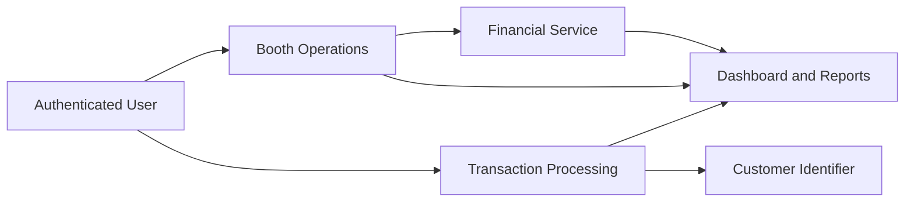
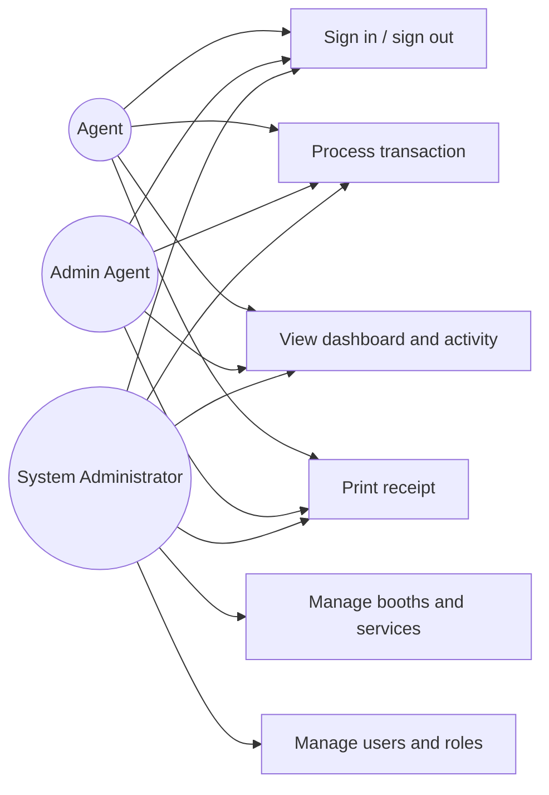
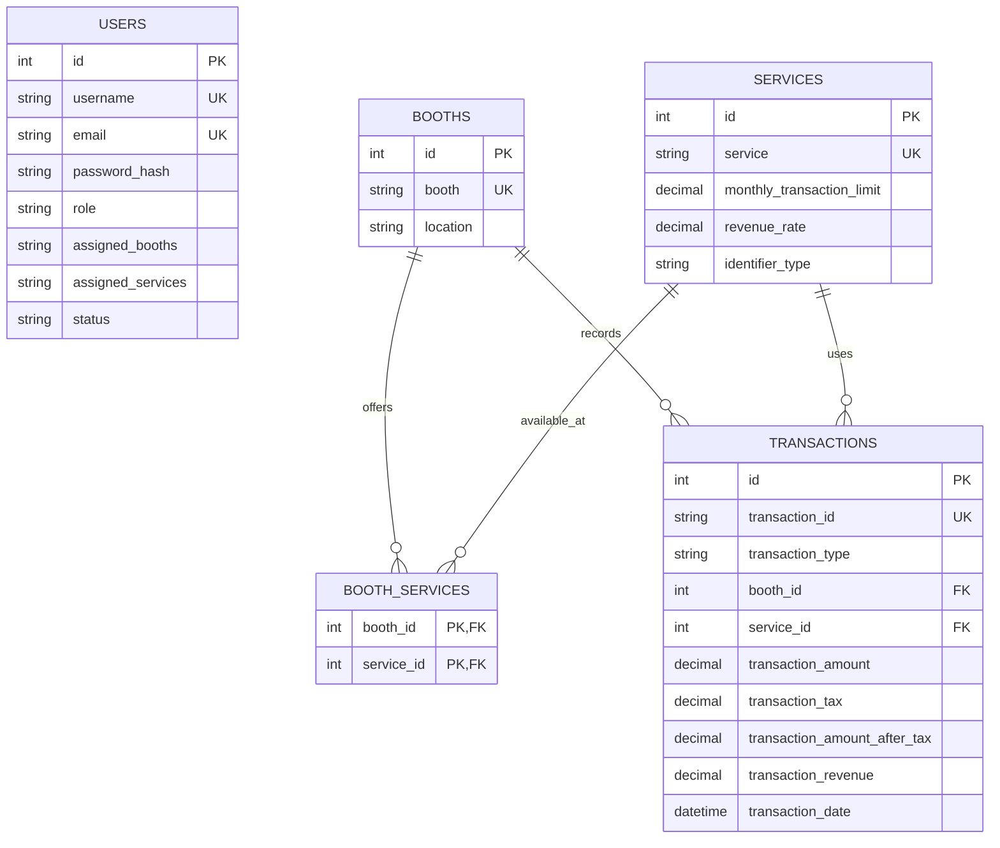

# Wina Bwangu Design Diagrams

These Mermaid diagrams were prepared by our group and can be rendered in Mermaid Live, GitHub or a Markdown editor that supports Mermaid.

## Conceptual model

## Use-case diagram

## Entity relationship diagram

